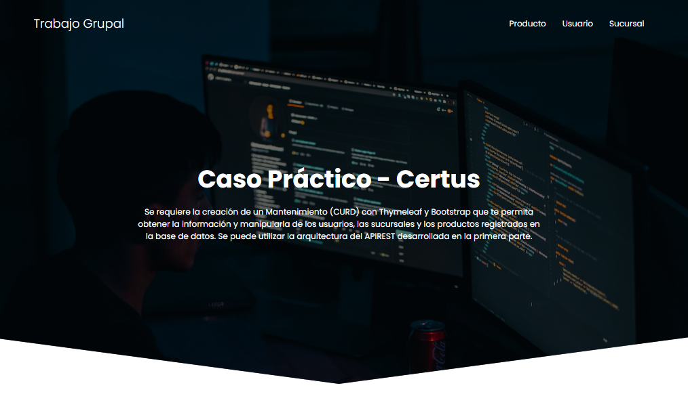

# Caso Práctico - Certus
Se requiere la creación de un Mantenimiento (CURD) con Thymeleaf y Bootstrap que te permita obtener la información y manipularla de los usuarios, las sucursales y los productos registrados en la base de datos. Se puede utilizar la arquitectura del APIREST desarrollada en la primera parte.

